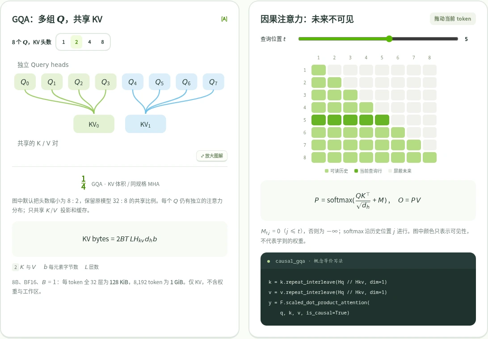
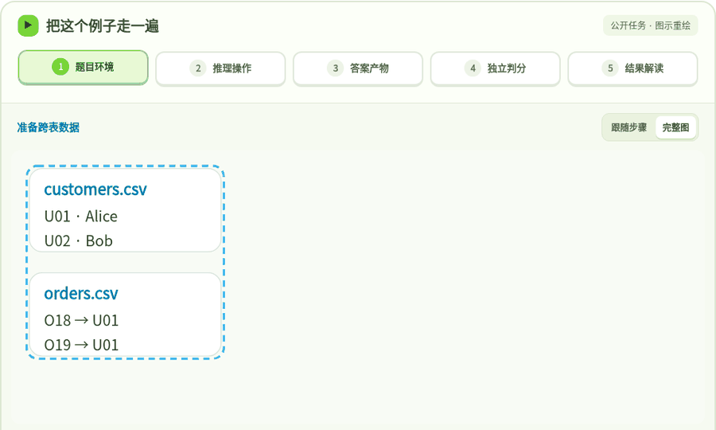

# Clearer Notes · 渐明

**Interactive guides to LLMs, AI agents, and inference systems.**

Follow ideas from a diagram to the underlying mechanism, source material, and
code. These learning notes connect model internals, inference systems, agent
memory, and evaluation protocols.

**Guides are primarily in Simplified Chinese; the homepage UI supports English
and Chinese.** Switching the homepage language does not translate the guides.

[Read the guides](https://2218342221.github.io/blog/) ·
[中文](README.md) ·
[RSS](https://2218342221.github.io/blog/rss.xml) ·
[Issues](https://github.com/2218342221/blog/issues)

[](https://github.com/2218342221/blog/actions/workflows/deploy.yml)

[](https://2218342221.github.io/blog/lab/llm-architecture-atlas/)

## Explore the guides

| Guide                                                                                                 | What you can explore                                                                                                                                                      |
| ----------------------------------------------------------------------------------------------------- | ------------------------------------------------------------------------------------------------------------------------------------------------------------------------- |
| [Agent Memory](https://2218342221.github.io/blog/lab/agent-memory/)                                   | 19 interactive animations organized around three needs: maintaining task state, preserving facts and evidence, and transferring experience to future tasks.               |
| [LLM Architecture Atlas](https://2218342221.github.io/blog/lab/llm-architecture-atlas/)               | 10 chapters connecting model structures, equations, and downloadable small PyTorch teaching implementations.                                                              |
| [Inference Engine Academy](https://2218342221.github.io/blog/lab/inference-engine-academy/)           | 28 modules tracing nano-vLLM through scheduling, memory, execution, and production vLLM architecture.                                                                     |
| [LLM Benchmark Atlas](https://2218342221.github.io/blog/lab/llm-benchmark-atlas/)                     | 41 benchmarks and 48 cases explaining inputs, environments, tools, outputs, and scoring protocols. The animations illustrate protocols; they are not measured model runs. |
| [Software Engineering Classics](https://2218342221.github.io/blog/lab/software-engineering-classics/) | 25 learning units across five books: DDIA, DDD, Clean Code, Clean Architecture, and Refactoring. An original study companion to read alongside the books.                 |

The guides link to their sources and state their scope. Benchmark leaderboard
tables are dated snapshots, and the PyTorch examples use small models to explain
computation; they do not reproduce pretrained model capabilities.

## Choose a starting point

1. **Understand how a model becomes a serving system.** Start with the
   [architecture basics](https://2218342221.github.io/blog/lab/llm-architecture-atlas/#basics),
   try the [PyTorch lab](https://2218342221.github.io/blog/lab/llm-architecture-atlas/#lab),
   then follow the nano-vLLM route in
   [Inference Engine Academy](https://2218342221.github.io/blog/lab/inference-engine-academy/).
2. **Reason about agents and their evaluation.** Begin with the three memory
   needs in [Agent Memory](https://2218342221.github.io/blog/lab/agent-memory/),
   then use the [benchmark runtime guide](https://2218342221.github.io/blog/lab/llm-benchmark-atlas/#runtime)
   to distinguish tool access, execution environments, and scoring.

## What to expect

- Interactive diagrams and animations where supported, including step controls
  for following mechanisms and information flow.
- Links to papers, official documentation, and source code, with version and
  evidence boundaries described in the relevant guides.
- Search, topic browsing, and RSS for finding and following published notes.
- Optional downloadable HTML for supported guides, including Agent Memory,
  LLM Architecture Atlas, and LLM Benchmark Atlas. External source links still
  require an internet connection.

<details>
<summary>Watch a Terminal-Bench case, from task to independent validation</summary>

[](https://2218342221.github.io/blog/lab/llm-benchmark-atlas/#case-animation-terminal-1)

Captured from the guide's five-step interactive diagram. Open the image link to
choose a step, play, or pause the walkthrough yourself.

</details>

## Run locally

Use **Node.js 22.12 or newer**; Node.js 24 is recommended.

```bash
git clone https://github.com/2218342221/blog.git
cd blog
npm ci
BASE_PATH=/blog/ npm run dev
```

Open [http://localhost:4321/blog/](http://localhost:4321/blog/).
The site uses Astro, and its deployment path is `/blog/`.

To build and preview with the same URL settings as the published site:

```bash
SITE_URL=https://2218342221.github.io BASE_PATH=/blog/ npm run build
BASE_PATH=/blog/ npm run preview
```

The build runs Astro/TypeScript checks and writes the static site to `dist/`.
See the [writing and publishing guide](docs/WRITING.md) for article metadata,
draft handling, images, and deployment steps.

## Find your way around the repository

```text
src/content/notes/   Article metadata, introductions, and guide links
src/components/      Shared UI and cover diagrams
src/config/site.ts   Site identity and topics
public/lab/          Published static guides
docs/WRITING.md      Content maintenance and publishing instructions
```

## Help improve a guide

[Open an issue](https://github.com/2218342221/blog/issues/new) for a typo, broken
link, unclear explanation, or a suggestion for a worked example. Include the
guide URL and the relevant section; for a reproducible problem, describe the
steps, expected result, and what happened instead.

Corrections backed by a source link and small, reproducible examples are useful
starting points for discussion. If these guides help your learning, a star is a
simple way to support the project and find it again.

Some material under `public/lab/` is an independently published static artifact;
this repository may not contain the original authoring project for every guide.
Code examples are educational implementations, and their scope is documented in
the corresponding guide.
